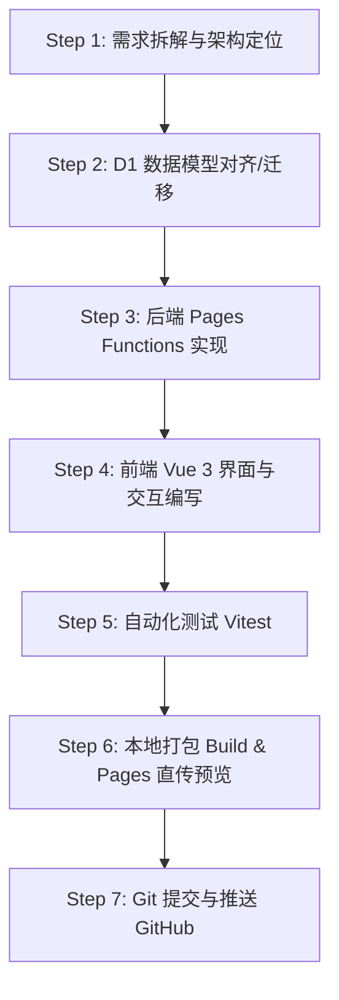

# LabHub 协同开发与 Vibe Coding 执行手册（面向 Codex / AI 编程助手）

> 本文档专为在合作者电脑上运行的 **Codex / AI Agent** 编写。旨在指导 Codex 理解本项目架构、掌握已授权的 Cloudflare Wrangler CLI 操作权限，并遵循标准化闭环流程完成需求研发、D1 数据库管理、自动化测试、秒级预览部署与 GitHub 同步。

---

## 0. 核心架构与事实基准（不可变边界）

1. **项目根目录与子目录职责**：
   - **前端与全栈服务**：位于 `frontend/` 目录（Vue 3 + Vite + Cloudflare Pages Functions + Hono API + Wrangler）。
   - **所有的 npm 构建与 wrangler 命令，必须在 `frontend/` 目录下执行**。
2. **部署架构**：
   - **托管平台**：Cloudflare Pages（项目名：`labhub`）。
   - **后端 API**：Cloudflare Pages Functions（位于 `frontend/functions/api/`，基于 TypeScript + Hono）。
   - **关系型数据库**：Cloudflare D1（数据库名：`labhub-db`）。
   - **网络协议与邮件**：使用原生 `cloudflare:sockets` 直连 IMAPS (993) 与 SMTPS (465/587)，无第三方外部邮件服务依赖。
3. **已授权状态**：
   - 当前电脑已通过合作者账号完成 `npx wrangler login` 授权；
   - 合作者账号已被赋予该项目的 **管理员权限**；
   - Codex 可直接通过终端工具调用 `npx wrangler` 操作云端 D1 数据库与 Pages 部署，**无需重复登录**。

---

## 1. Cloudflare D1 数据库查询与运维标准命令

Codex 在理解数据结构、排查 bug 或进行数据库迁移时，请在 `frontend/` 目录下调用以下命令：

### 1.1 查询表结构与数据（只读）
```bash
cd frontend

# 查看所有数据表
npx wrangler d1 execute labhub-db --remote --command="SELECT name FROM sqlite_master WHERE type='table';"

# 查看特定表的结构（例如 users 或 seminars）
npx wrangler d1 execute labhub-db --remote --command="PRAGMA table_info(users);"

# 查看数据（支持完整 SQL 查询，注意使用 LIMIT 避免返回过大）
npx wrangler d1 execute labhub-db --remote --command="SELECT id, name, real_name, email, role FROM users LIMIT 10;"
```

### 1.2 执行数据库迁移与修改（写操作）
> [!IMPORTANT]
> 涉及 D1 结构变更（如添加字段、新表）时，优先采用 **加法迁移（Additive Migration）**，绝不 drop 或清空现有业务表。

```bash
cd frontend

# 执行单条 DDL 语句（例如为表新增字段）
npx wrangler d1 execute labhub-db --remote --command="ALTER TABLE users ADD COLUMN last_active_at DATETIME;"

# 执行 SQL 迁移脚本文件
npx wrangler d1 execute labhub-db --remote --file=../scripts/your_migration.sql
```

### 1.3 备份与快照导出
```bash
cd frontend

# 创建云端快照
npx wrangler d1 backup create labhub-db

# 导出完整 SQL 数据文件到本地
npx wrangler d1 export labhub-db --remote --output=./backup_remote.sql
```

---

## 2. 需求研发与交付的 7 步标准闭环流程

当用户向 Codex 提出新需求或缺陷修复时，Codex 必须遵循以下 **“7 步标准工程流水线”** 执行：



### Step 1: 需求拆解与范围定位
- **界面修改**：检查 `frontend/src/views/`（路由主视图）与 `frontend/src/components/`（业务通用组件）。
- **API 修改**：检查 `frontend/functions/api/routes/` 对应路由模块。
- **数据流转**：前端通过 `frontend/src/api/client.js` 统一封装 Axios 请求，保持方法名语义化。

### Step 2: D1 数据模型变更（如涉及）
1. 先通过 `npx wrangler d1 execute labhub-db --remote --command="PRAGMA table_info(...);"` 确认线上真实表字段；
2. 执行线上 ALTER 或 CREATE 语句；
3. 同步更新 `scripts/schema_d1.sql`，保持仓库中的 DDL 文档与云端最新状态一致。

### Step 3: 后端 API 实现规范 (`frontend/functions/api/`)
1. **统一运行时**：基于 Hono 框架，通过 `c.env.DB` 访问 D1；
2. **预编译与参数绑定**：所有 SQL 必须使用参数化绑定防注入：
   ```typescript
   const result = await c.env.DB.prepare(
     'SELECT * FROM users WHERE email = ?'
   ).bind(email).first()
   ```
3. **鉴权守卫**：
   - 需要登录：路由前加 `authMiddleware`，使用 `requireUser(c)`；
   - 管理员权限：使用 `requireAdmin(c)`；
   - 隐私隔离：在查询与操作中强制绑定当前登录用户 `user.id`。

### Step 4: 前端界面规范 (`frontend/src/`)
1. **风格一致性**：保持科技感玻璃拟态（Liquid Glass / Dark Panel）界面风格与 CSS 变量系统；
2. **弹窗与遮罩层规范（高危避坑）**：
   - 所有弹窗/抽屉均采用 `BaseDialog.vue`；
   - **绝对不能** 随意在弹窗容器上使用单纯的 `@click="close"`，必须遵循已经修复的 `isBackdropMouseDown` 双重坐标判定，防止用户选中文本向左拖出边界时误退出。
3. **输入组件**：登录/注册等高交互表单优先使用 `WaveInput.vue`。

### Step 5: 自动化单元测试验证（必须执行）
在修改任何核心工具类或发信逻辑后，必须运行全量测试：
```bash
cd frontend
npx vitest run
```
- **通过标准**：所有测试套件（9+ files，58+ tests）必须 100% 全部通过。
- 如新功能改变了预期文案或逻辑，同步补充或更新对应的 `*.test.js` 测试用例。

### Step 6: 生产环境打包 & Cloudflare Pages 直传预览
为了让合作者和导师能够秒级在公网看到最新修改效果，无需等待 GitHub Actions 排队：
```bash
cd frontend

# 1. 静态打包构建（验证无语法/类型错误）
npm run build

# 2. 直传至 Cloudflare Pages 生产预览
npm run pages:deploy
```
- 部署成功后，终端会输出公网预览地址（如 `https://labhub.pages.dev`）。

### Step 7: Git 提交并推送到 GitHub
直传验证通过后，将完整代码提交入库并推送：
```bash
# 检查工作区变动
git status

# 暂存修改文件
git add <modified-files>

# 规范化语义提交
git commit -m "feat/fix: <简明扼要的修改描述>"

# 推送到远程 main 分支
git push origin main
```
- 推送到 GitHub 后，会自动触发 `.github/workflows/deploy.yml` 的 Actions 自动化部署流水线，确保仓库历史与云端部署保持双重同步。

---

## 3. Codex 快捷诊断与常用故障排查

| 故障现象 | 根因排查 | 解决方案 |
| :--- | :--- | :--- |
| `npx wrangler` 报错 `Not logged in` | OAuth Token 过期或未识别 | 执行 `cd frontend && npx wrangler login` 重新网页授权 |
| D1 操作报 `No database found` | 数据库名错误或缺少 `--remote` | 确保使用 `--remote` 且数据库名为 `labhub-db` |
| 构建报错 `Could not resolve ...` | 导入路径或大小写拼写错误 | 检查 `src/` 下模块相对路径，执行 `npm run build` 查看 Vite 错误栈 |
| 页面报 `400 / 邮件正文不能为空` 等参数错误 | 前后端传参字段名不匹配 | 检查 `functions/api/routes/*.ts` 接收的 JSON key 与前端 axios 发送的 key 是否严格一致 |
| 拖动选中文本时弹窗异常关闭 | 破坏了遮罩双重点击判定 | 检查 `BaseDialog.vue` 是否保留了 `mousedown/mouseup` 遮罩坐标防抖校验 |

---

## 4. 给 Codex 的一句话指导原则

> “修改代码前先查结构，写完代码先跑 vitest 和 build，部署直接用 `npm run pages:deploy` 直传 Cloudflare，最后提交 git push。”
